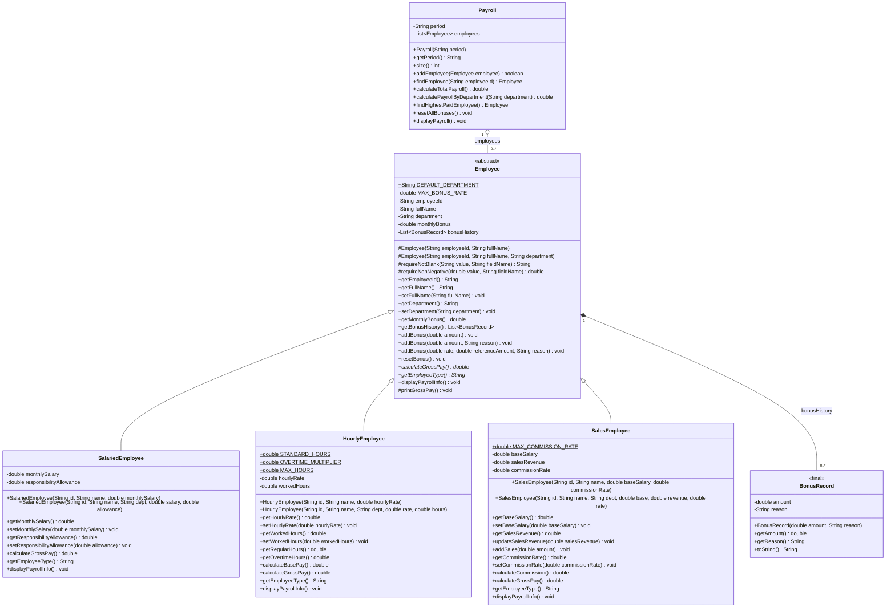

# LTHDT - Tuần 4: Hệ thống tính lương và thưởng nhân sự

- Mã sinh viên: 202419055
- Họ tên: Phí Việt Hiếu

Minh họa kế thừa, nạp chồng constructor / phương thức (`addBonus`), ghi đè (`calculateGrossPay`)
và đa hình qua bảng lương `Payroll`.

## Cấu trúc thư mục

```
src/Employee.java          # lớp cơ sở trừu tượng, 3 phiên bản addBonus()
src/BonusRecord.java       # một khoản thưởng (số tiền + lý do)
src/SalariedEmployee.java  # nhân viên lương cố định
src/HourlyEmployee.java    # nhân viên theo giờ (vượt 160h x1.5)
src/SalesEmployee.java     # nhân viên kinh doanh (lương cơ bản + hoa hồng)
src/Payroll.java           # bảng lương một kỳ, tổng hợp đa hình
src/Main.java              # kiểm thử phần C và 30 tình huống biên/lỗi (C.1)
```

## Sơ đồ lớp

Ký hiệu: `+` public, `-` private, `#` protected, `$` static, `*` abstract;
`<|--` kế thừa, `o--` kết tập (aggregation), `*--` hợp thành (composition).



Ghi chú: `calculateGrossPay()`, `getEmployeeType()`, `displayPayrollInfo()` trong ba lớp dẫn xuất
là phương thức **ghi đè** (`@Override`); ba phiên bản `addBonus()` trong `Employee` là **nạp chồng**.

## Chạy

```
javac -encoding UTF-8 -d out src/*.java
java -cp out Main
```
